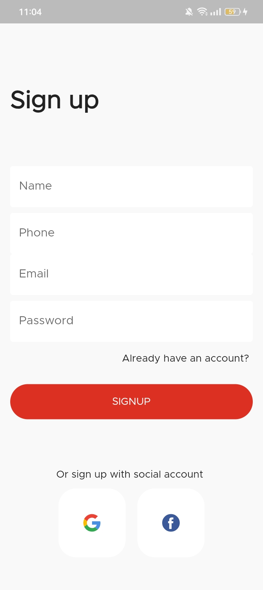
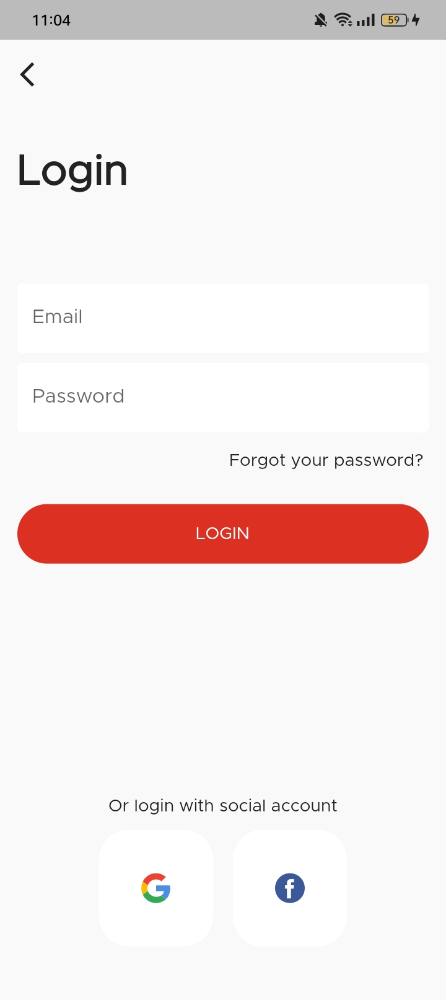

# Flutter Authentication 

Simplify authentication and session management in your Flutter app with REST Api

## ✨ Features

- [x] user sign-up, login, and management.
- [x] Session Management: Seamlessly manage user sessions using Shared Preferences.

## 📸 ScreenShots

| Auth                              | App                               |
| --------------------------------- | --------------------------------- |
|   |   |
|   |  |

